# Get started with Application Insights Demo

This repository contains get started with Application Insights hands on script.


## Configuring application to connect to Application Insights

1. To begin, please clone or download this repo and open Visual Studio Solution (.sln file).
2. In Visual Studio login or add Microsoft Account for which you have activated [Microsoft Azure Subscription](https://azure.microsoft.com/en-us/free/). 

  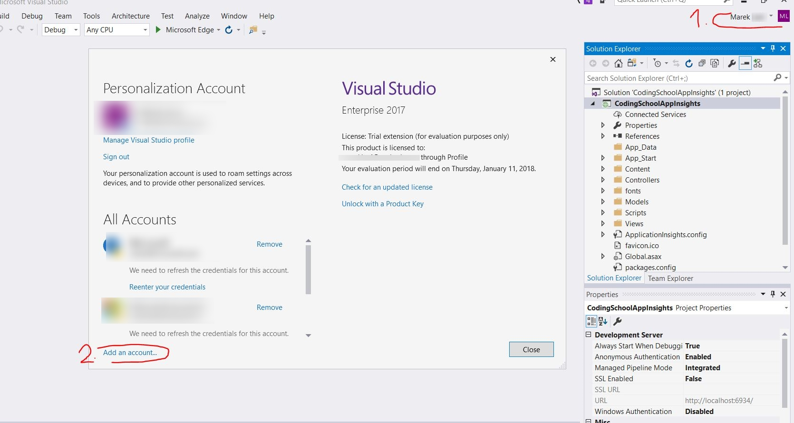


3. Connect the project to Application Insights. Right click the project and select Configure Application Insights

   

4. Click Update SDK to download latest Application Insights packages to your application and click Start Free

   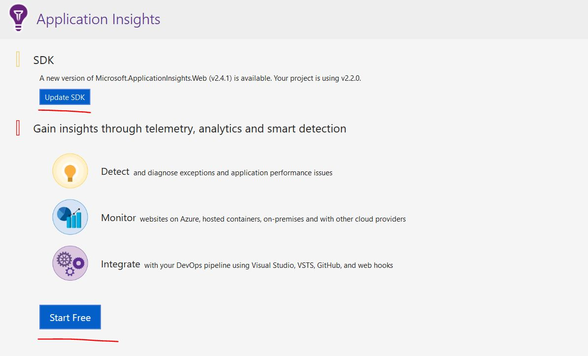

5. In subsequent step select Account for which you have Active Azure subscription in which you want to run the App Insights Resource, select correct Azure subscription and hit Configure Settings what will take you to the next step. If you do not want to allow overspend, resp. you do not want to pay for the service check the "Application Insights will remain free..." checkbox. Note that after you hit the limits, that are set for free App Insight environment the logs will not be collected till the next billing month period.

   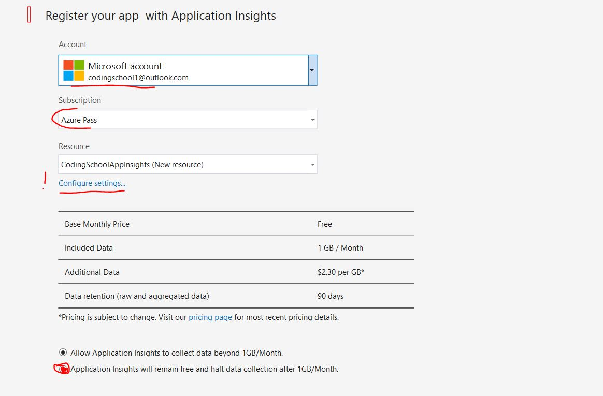

6. Configure the name of your App Insights resource and  the resource group in which it will be placed. Please also select region/Data Center in which App Insights for your app will run. ( **Note!!!!! :** If you are attending CodingSchool event, please follow the naming convention from the picture below) After setting this, you can proceed and Register with the Application Insights.

   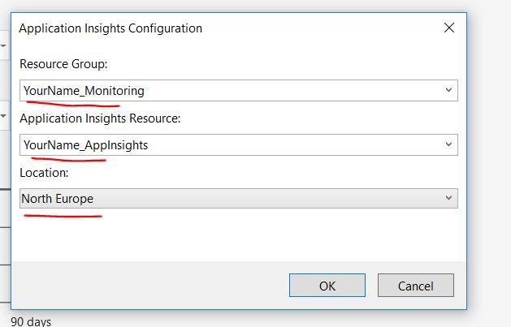

7. Now our app is almost configured, but we also want to activate collection of native traces

   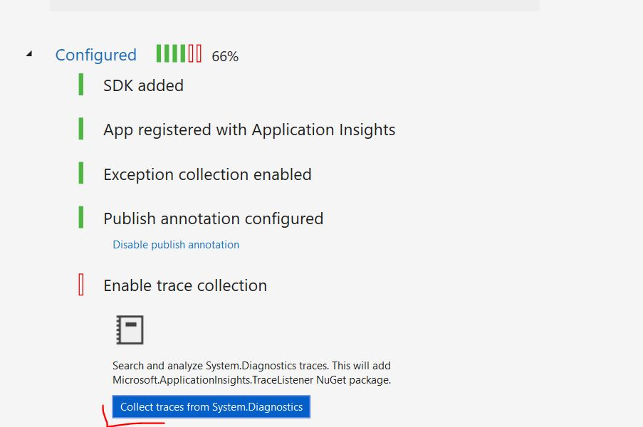


8. Now we can  run our app and it will be automatically sending logs to Application Insights.

   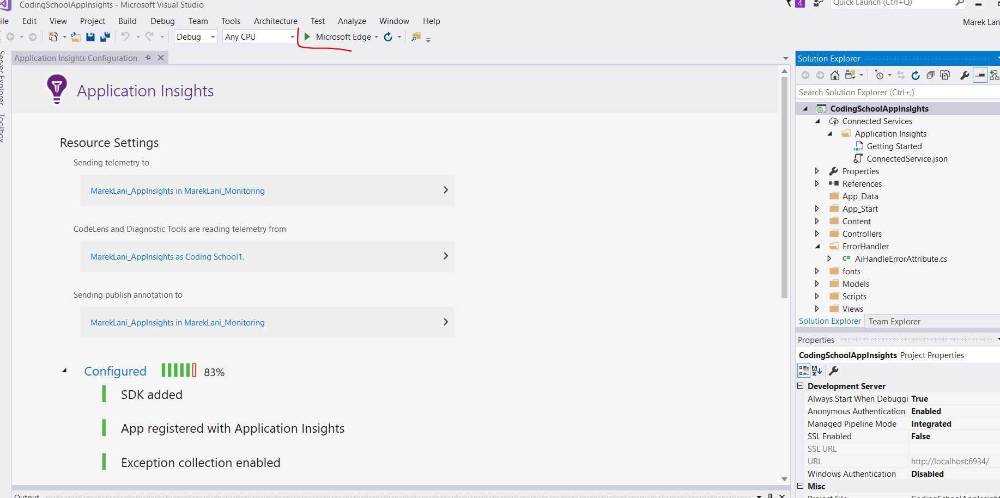

   ​

9. After application runs, please register new account so it generates query to database, as later we will demonstrate how App Insights track also Database dependencies

   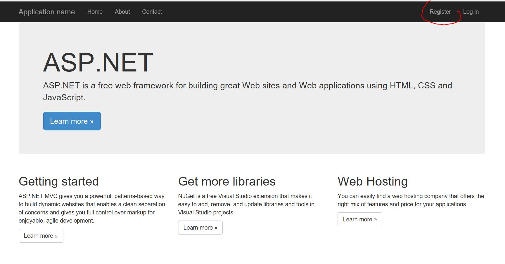


## Exploration of Application Insights

1. Navigate to portal.azure.com and login with the Microsoft account you have used in previous steps.

2. Go to Resource Groups and locate the resource groups you have created for you Application Insights service and then on the opened blade click the App Insights Service.

   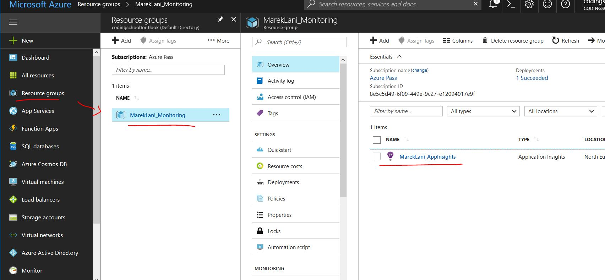

   ​

3. Explore graphs and information surfaced on the dashboard of your App Insights Service.

   

   ​

4. On the main blade of App Insights locate Live Stream tile and click it. Note that at this point your app should be running in order to see streamed live data. Try to navigate within the web app and notice how the graphs update almost in real time. Try to open Task manager on your computer and try to compare CPU usage reported by Task Manger and App Insights.

5. In the next step we will modify our application, so we can see even richer capabilities, that App Insights provide (e.g exception tracking, dependency tracking ...) First open file index.cshtml located in Views -> Home folder. And add following code at the end of file:

   ```javascript
   @section Scripts{
   <!--JSON Example-->
   <script type="text/javascript">
   $(document).ready(function () {
       var root = 'https://jsonplaceholder.typicode.com';
       $.ajax({
           url: root + '/posts/1',
           method: 'GET'
       }).then(function (data) {
           console.log(data);
       });
   });
   </script>
   }
   ```
   This will fire simple Ajax request, which we will be able to see in Application Map which was generated by App Insights.

   To report additional activities/events please modify the HomeController.cs file located in Controllers folder and replace the code with the following one:

   ```c#
   using Microsoft.ApplicationInsights;
   using Microsoft.ApplicationInsights.DataContracts;
   using System;
   using System.Collections.Generic;
   using System.Linq;
   using System.Net.Http;
   using System.Threading;
   using System.Threading.Tasks;
   using System.Web;
   using System.Web.Mvc;

   namespace CodingSchoolAppInsights.Controllers
   {

   	public class HomeController : Controller
   	{
      		public async Task<ActionResult> Index()
       	{
          		var client = new TelemetryClient();

   			//Tracking exception, unhandled exceptions are tracked automatically
               client.TrackEvent("Index loaded");

               try
               {
                   throw new Exception("exception");
               }
               catch (Exception e)
               {
                   client.TrackException(new ExceptionTelemetry(e));
                   //client.Track
               }

           	//Here we simulate e.g. registration request in external solution and we track it as a dependency manually
           //It would however be tracked automatically, we will se it in application map as our own dependency with name MyDependency
          		var startTime = DateTimeOffset.Now;
           	var dt = new DependencyTelemetry();

           	SimulateRequest();

           	client.TrackDependency("DependencyType", "registration", "MyDependency", "{random data}", startTime, TimeSpan.FromMilliseconds((DateTimeOffset.Now - startTime).TotalMilliseconds), "201", true);

           	//We are tracking actual Stack Trace
           	client.TrackTrace((new System.Diagnostics.StackTrace()).ToString());

           	//Here we call external service - dependency will be tracked automatically
           	var httpClient = new HttpClient();
           	var res = await httpClient.GetAsync("http://bing.com");

           	return View();
       	}

       	public ActionResult About()
       	{
           	ViewBag.Message = "Your application description page.";
          	    return View();
       	}

       	public ActionResult Contact()
       	{
           	ViewBag.Message = "Your contact page.";
           	return View();
       	}
       	
       	private void SimulateRequest()
       	{
           	Thread.Sleep((new Random()).Next(2000));
       	}
   	}
   }
   ```

   ​

   Now please start the application again and perform some activity to simulate user activity. 

   ​

   6. As a next step, we will explore all the information that were sent to the Application Insights from our application. To do that locate Search button on main blade of App Insights and try to explore the events that have been sent from our app.

   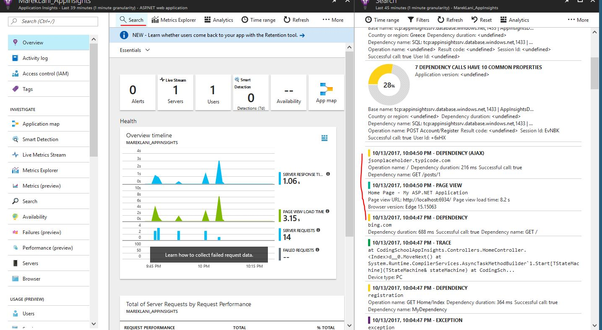

   Note that it can  take some time for App Insights to receive and digest the data and display it.

   7. Now we will create our custom charts and we will add them to main dashboard (and optionally to favorites) To do so just click Metrics Explorer and Add Chart. On this page try to experiment with different chart types and metrics surfaced to the graphs.

      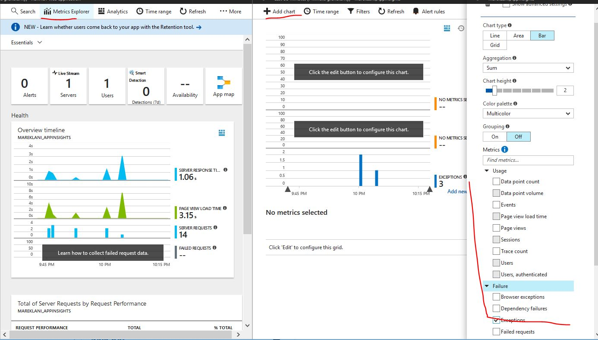

   8. You can Pin specific group of charts into Main Azure portal by clicking. With this you will achieve that it will be displayed on "Home page" of your Azure portal and so you can access the important performance information quickly.

      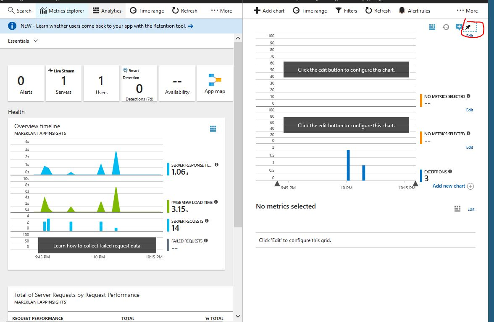

Now when you click Dashboard link in main menu, you will see that the tile was added to your main dashboard.

9. Now we will explore **Application map**, where we can see all the main building blocks and dependencies which our application has. When you will expand all the points within the Application map you should see something similar to picture below. Within every block you can drill down to specific requests. E.g. you can see the request to database, you can see how long did it take to call external service, in our case bing.com or how long did it take to our custom dependencies called registration to execute. On the client side, you can also see how many page view there were and when you expand the block, you can explore details related to the ajax request we have added. Now please click on warning or success icon within the database block.

   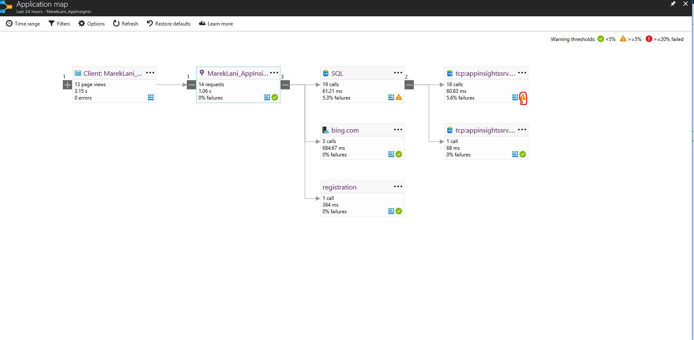

10. After doing so you can further drill down and see further details related to request sent to database. You can do it the same way for every other requests that are displayed within Application map.

   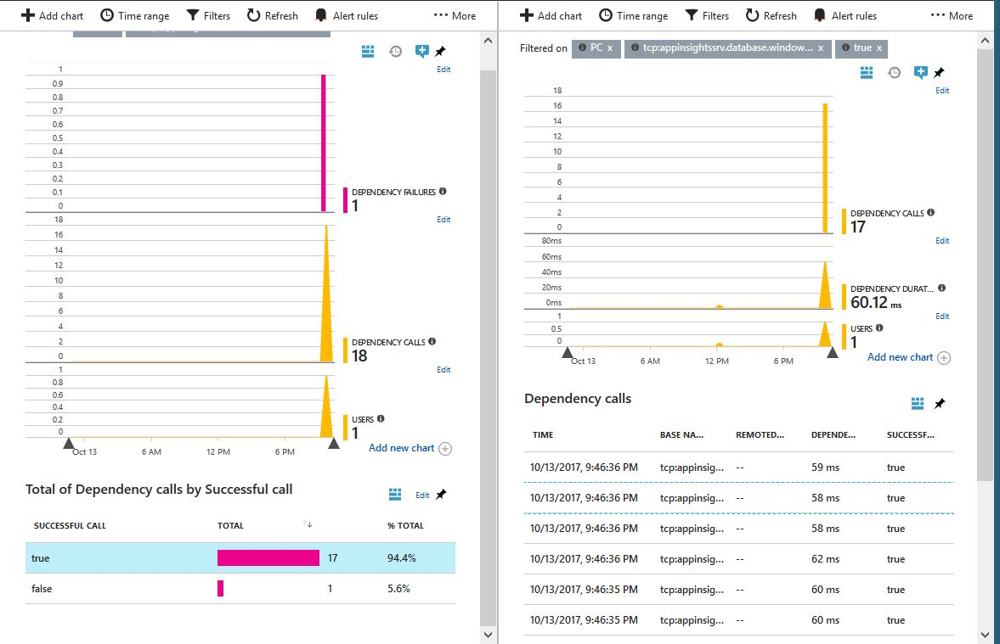

11. Now we will add **Alert** which will notify us if there was Exception in last five minutes. To achieve that please on the main Application Insights blade click Alerts tile. You will be navigated to Azure Monitor, thru which we will add new alert. Now click Add metric alert

    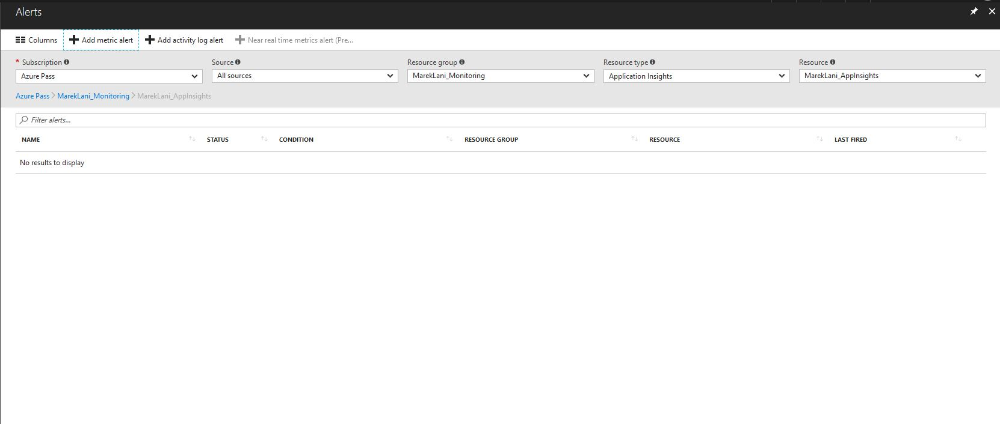


And in subsequent configuration window set following settings (**Note!!**: into Additional Administrators emails provide your own email, so you get notified) and click save.

​	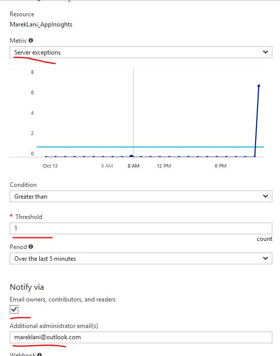


Now when you go to home page of our application it should generate exception and in five minutes you will be notified about the fact, that there is exception in your solution. In real world that would impulse for you to go and diagnose further, what was cause of the exception.

12. Application Insights also allow us to monitor **availability** of our application thru tests. These tests can be of two types. First is simple "Url ping test" where App Insights regularly generates ping requests from selected regions to you application and second type is Multi-step Web test. Within these test you can essentially record some important use case scenarios (e.g. for eshop it can be the whole purchase process) and you can regularly run these test to be sure, that there is no error in your application which would cause some serious problem (e.g. customers are not able to purchase the goods) due to this error. We will add Url Ping test, But before doing so we need to open channel to our localhost, so App Insights are able to reach Web Site, that is running only on our local machine. To Achieve that we will use tool called **ngrok**. You can find it in the folder ngrok (in this repo) and attached is also file command.txt. What you need to do is open command prompt, navigate to the ngrok folder and run the command with one small change. You need to change the word port for the actual port number on which tour web app is running. If you did not change any settings it should be 6934. Now when we have opened the port, we need to copy the Url of the channel. See picture below:

    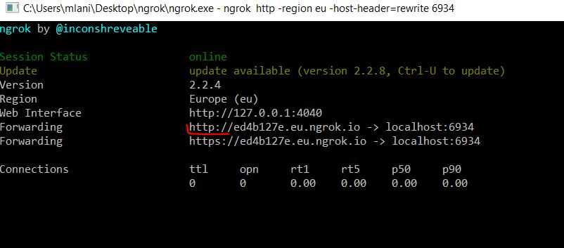 

Now we can configure the test. Please click the **Availability** tile, then **Add test** . On the configuration blade you can change the setting as you wish, but be sure to provide correct address of your ngrok channel.

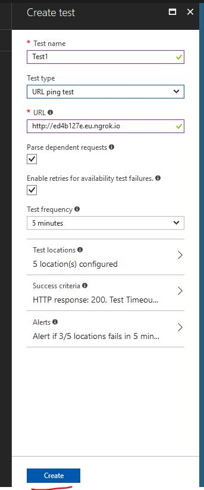

Now your test will run regularly base on the frequency you have selected. You can see the results after clicking Availability tile again.

13. As a last thing we will have a look on Application Insights integration with code lens in Visual Studio (Available only for VS Studio Enterprise) . When you get back to Visual Studio and navigate to Index method of HomeController you will see that some information got propagated back to Visual Studio from Application Insights and now you can see directly in Visual Studio while developing, whether you code has some performance issues and again you drill down to identify what is the cause of the problem. In ideal case you see just a green tick :).

    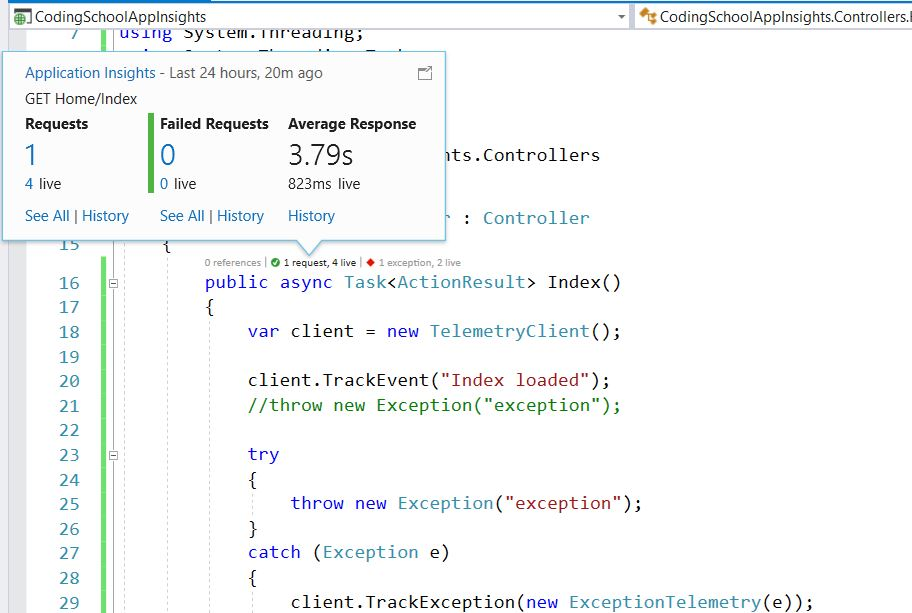

